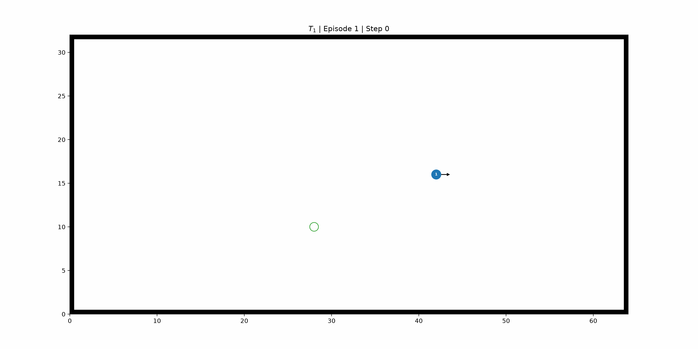

# Baggage Handling Optimization with Reinforcement Learning

This project was developed as part of an internship focused on autonomous navigation and baggage handling optimization in airport environments.

The objective is to minimize transport time while ensuring collision-free navigation for multiple Automated Guided Vehicles (AGVs). The simulator is first considered in a more general Autonomous Mobile Robot (AMR) navigation framework and relies on reinforcement learning to learn decentralized navigation policies from local observations.

The current implementation uses the **Soft Actor-Critic (SAC)** algorithm and supports both single-agent and multi-agent training through **parameter sharing**.

<p align="center">
  
  <br>
  <em>Examples of a random, warehouse and crossing scenarios with agents and static and dynamic obstacles.</em>
</p>

## Features

- Gymnasium-compatible navigation environment
- Configurable  with static and dynamic obstacles
- Random, warehouse, crossing, hospital and airport environments
- A* path planning for moving obstacles
- Local observation model based on occupancy grids
- Soft Actor-Critic (SAC) implementation
- Sequential and probabilistic curriculum learning
- Multi-agent training with parameter sharing
- Training, validation and evaluation pipelines
- Automatic logging, plotting and animation generation

## Project Structure

| Directory / File | Description |
|---|---|
| `configs/` | Environment, agent, reward, task and SAC configurations. |
| `docs/` | Technical user guide and modeling report. |
| `figures/` | Generated figures, renders and animations. |
| `logs/` | Training, validation and evaluation metrics. |
| `rl/` | Reinforcement learning implementation and saved policies. |
| `simulator/` | Simulation environment, entities and path planning. |
| `utils/` | Configuration loading, logging and plotting utilities. |
| `cli.py` | Command-line interface definition. |
| `main.py` | Main entry point. |
| `runner.py` | Training, validation, evaluation and visualization pipelines.

## Installation

Clone the repository and install the required dependencies.

```bash
git clone https://github.com/sayansuos/baggage-handling-rl.git
cd baggage-handling-rl

python -m pip install -r requirements.txt
```

Create a virtual environment and activate it.

- On macOS and Linux:
```bash
python -m venv .venv
source ./.venv/bin/activate
```
- On Windows:
```bash
python -m venv .venv
.\.venv\Scripts\activate
```


## Usage

The project is controlled from the command line:

```bash
python main.py <command> [options]
```

Available commands are:

| Command    | Description                                                        |
| ---------- | ------------------------------------------------------------------ |
| `train`    | Train a SAC policy using a sequential or probabilistic curriculum. |
| `validate` | Validate a policy on training tasks.                               |
| `evaluate` | Evaluate a policy on dedicated evaluation tasks.                   |
| `animate`  | Generate scenario renders and policy animations.                   |
| `demo`     | Interactively display previously generated animations.             |


For example:

```bash
python main.py train --task-section "train_v1" --policy-name "policy_v1"
```

Policies and checkpoints are saved under: `rl/sac/weights/<policy>/<checkpoint>/`.

## Documentation

The project documentation is available in the `docs/` directory.

- [Technical User Guide](docs/user_guide.pdf) — installation, configuration and simulator usage.
- [Modeling Report](docs/modeling_report.pdfpdf) — environment modeling, reinforcement learning algorithm and experimental protocol.
