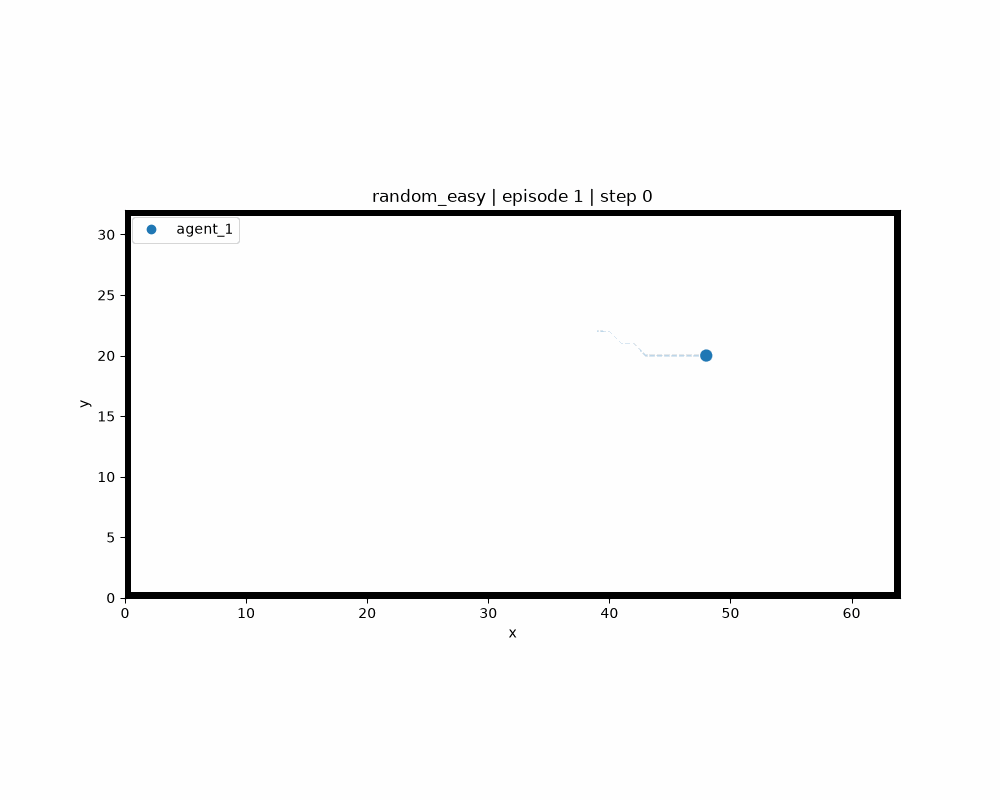

# Baggage Handling Optimization with Reinforcement Learning


This project is developed as part of an internship focused on optimizing baggage handling systems in airport environments. The objective is to improve the time efficiency and coordination of multiple Automated Guided Vehicles (AGVs) using reinforcement learning (RL) techniques.

**Objective:** The goal is to minimize transport time while ensuring collision-free navigation in a decentralized setting where agents rely solely on local observations and do not explicitly communicate with one another.

To address this problem, we first consider a more general autonomous navigation framework based on Autonomous Mobile Robots (AMRs). This approach allows us to study and validate reinforcement learning methods in a less constrained environment before progressively adapting them to the specific requirements of airport baggage handling systems.

<p align="center">
  
  <br>
  <em>Examples of a random, warehouse and crossing scenarios with agents and static and dynamic obstacles.</em>
</p>

## Current Work

In this first phase, we focus on training a standard reinforcement learning algorithm, Soft Actor-Critic (SAC), on a single agent. The objective is to evaluate the feasibility of the approach and validate the proposed environment before extending the study to more complex multi-agent scenarios.

The first experimental plan is available in: `docs/reports/Plan expérimental 1.pdf`.

## Project Status (2026-06-12)

### Completed

- [x] Gymnasium-compatible simulation environment
- [x] Environment generation with static obstacles, moving obstacles and agents (random, warehouse and crossing scenarios)
- [x] Agent and obstacle motion based on A* path planning
- [x] Local observation system (local maps, relative goal position, orientation and velocity)
- [x] Reward function implementation (progress, abrupt rotation, safety distance and collision penalties)
- [x] Episode logging and visualization tools
- [x] Training and evaluation pipeline

### In Progress

- [ ] SAC integration and validation (replay buffer, actor-critic networks and training procedure)
- [ ] Training metrics and visualization (rewards, losses and best-episode rendering)
- [ ] Reward tuning

### Next Steps

- [ ] Hyperparameter selection
- [ ] Single-agent SAC experiments
- [ ] Metrics analysis and performance evaluation

## Project Structure

| Directory / File | Description |
|------------------|-------------|
| `configs/` | Configuration files for environments, agents, reward functions, experiments and training parameters. |
| `docs/` | Project documentation, reports and experimental plans. |
| `figures/` | Generated figures, plots, animations and visual results. |
| `logs/` | Training logs, evaluation metrics and experiment outputs. |
| `rl/sac/` | Implementation of the SAC algorithm, including neural networks, replay buffer and training procedures. |
| `simulator/entities/` | Definition of all simulation entities, including agents, static obstacles and moving obstacles. |
| `simulator/environment/` | Gymnasium-compatible environment implementation, including observations, rewards, episode management and rendering. |
| `utils/` | Utility functions for plotting, logging, animations and configuration loading. |
| `main.py` | Main entry point used to launch experiments, training sessions and evaluations. |
| `runner.py` | Experiment execution pipeline responsible for running episodes, collecting metrics and saving results. |

## Installation

```bash
git clone https://github.com/sayansuos/baggage-handling-rl.git
cd baggage-handling-rl

pip install -r requirements.txt
```

## Usage

The project is controlled from `main.py`. Before running an experiment, select the desired execution mode by modifying the `MODE` variable:

```python
MODE = "simulation"
```

Available modes are:

| Mode | Description |
|--------|-------------|
| `"simulation"` | Runs environment simulations in parallel without reinforcement learning, using A* path planning. |
| `"train"` | Trains a SAC agent and saves training metrics. |
| `"test"` | Runs one simulation episode per configuration with live rendering and records performance metrics. |
| `"save"` | Generates an animation for one simulation episode per configuration without reinforcement learning. |

To run the project:

```bash
python main.py
```