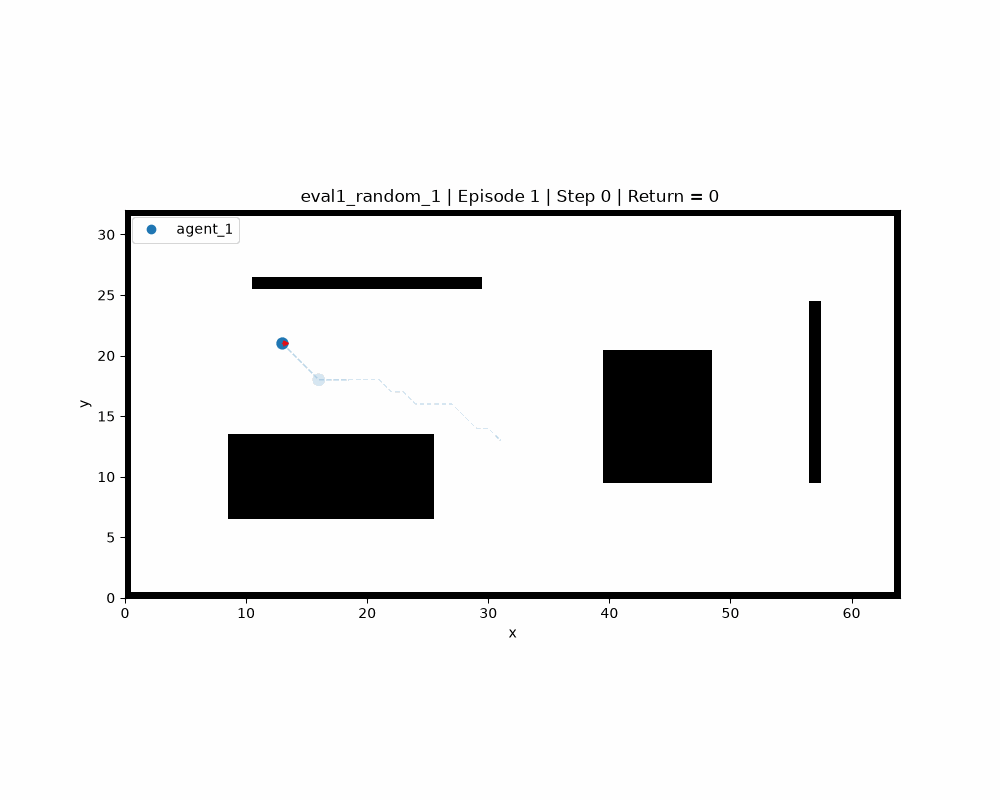

# Baggage Handling Optimization with Reinforcement Learning

This project is developed as part of an internship focused on optimizing baggage handling systems in airport environments. The objective is to improve the time efficiency and coordination of multiple Automated Guided Vehicles (AGVs) using reinforcement learning (RL) techniques.

**Objective:** The goal is to minimize transport time while ensuring collision-free navigation in a decentralized setting where agents rely solely on local observations and do not explicitly communicate with one another.

To address this problem, we first consider a more general autonomous navigation framework based on Autonomous Mobile Robots (AMRs). This approach allows us to study and validate reinforcement learning methods in a less constrained environment before progressively adapting them to the specific requirements of airport baggage handling systems.

<p align="center">
  
  <br>
  <em>Examples of a random, warehouse and crossing scenarios with agents and static and dynamic obstacles.</em>
</p>

## Features

- Gymnasium-compatible navigation environment
- Configurable environment generation (fixed, random, warehouse and crossing scenarios) with static and dynamic obstacles
- A* path planning for moving obstacles
- Local observation model based on occupancy grids
- Soft Actor-Critic (SAC) implementation
- Curriculum learning support
- Training, validation and evaluation pipelines
- Automatic logging, plotting and animation generation

## Project Structure

| Directory / File | Description |
|------------------|-------------|
| `configs/` | YAML configuration files for environments, agents, rewards and experiments. |
| `docs/` | User guide and project reports. |
| `figures/` | Generated figures, renders and animations. |
| `logs/` | Training, validation and evaluation metrics. |
| `rl/` | Reinforcement learning implementation (SAC). |
| `simulator/` | Environment, entities, observations and path planning. |
| `utils/` | Configuration loading, logging and plotting utilities. |
| `main.py` | Main entry point. |
| `runner.py` | Training, evaluation and visualization pipeline. |

## Installation

Clone the repository and install the required dependencies.

```bash
git clone https://github.com/sayansuos/baggage-handling-rl.git
cd baggage-handling-rl

python -m pip install -r requirements.txt
```

Create a virtual environment and activate it.

- On macOS and Linux:
```bash
python -m venv .venv
source ./.venv/bin/activate
```
- On Windows:
```bash
python -m venv .venv
.\.venv\Scripts\activate
```


## Usage

The project is controlled from `main.py`. Before running an experiment, select the desired execution mode by modifying the `MODE` variable:

```python
MODE = "simulation"
```

Available modes are:

| Mode | Description |
|------|-------------|
| `train` | Train one or several policies. |
| `validation` | Evaluate each policy on its training scenario. |
| `evaluation` | Evaluate one policy on all evaluation scenarios. |
| `demo` | Display policy executions. |
| `animation` | Generate animations and scenario renders. |

To run the project:

```bash
python main.py
```

## Documentation

The project documentation is available in the `docs/` directory.

- [User Guide](docs/user_guide/main.pdf) — installation, configuration and simulator usage.
- [Modeling Report](docs/modeling/main.pdf) — environment modeling, reinforcement learning algorithm and experimental protocol.
.

